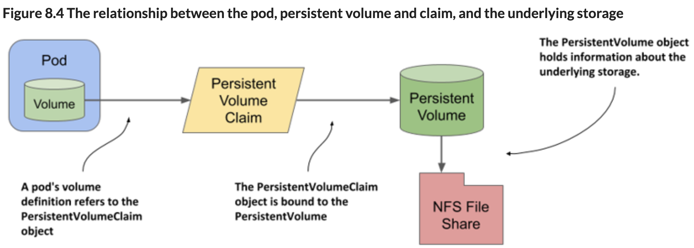

# springboot-kubernetes

### The hosts in K8s cluster:


### To export and import the docker images from local Mac to the K8s master node
```
docker build -t springboot-kubernetes:volume_mount .
docker save -o /tmp/springboot-k8s-volume_mount.tar springboot-kubernetes:volume_mount

scp /tmp/springboot-k8s-volume_mount.tar root@10.163.168.253:/tmp
```
On the K8s master node 253:
```
docker load -i /tmp/springboot-k8s-volume_mount.tar
[root@m2-ess-vm198 ~]# docker images
REPOSITORY                                         TAG            IMAGE ID       CREATED          SIZE
springboot-kubernetes                              volume_mount   271c17895546   17 minutes ago   171MB
```
### Tag it to the private docker repo (on K8s master node)
```
docker tag springboot-kubernetes:volume_mount 10.163.168.91:443/choudary/springboot-kubernetes:volume_mount
```

### Push to the private docker registry
Now we will be able to push the docker registry
```
docker push 10.163.168.91:443/choudary/springboot-kubernetes:volume_mount
```

### Deploy the 'deployment' and 'service' on the master node
Check the yaml files in the resources folder. 
Create a new namespace volume-mount first and create the deployment and service in that namespace.
```
kubectl create namespace volume-mount
kubectl apply -f deployment.yml --namespace=volume-mount
kubectl apply -f service.yml --namespace=volume-mount
```
#### Deployment description

```
[root@m2-ess-vm198 volume_mount]# kubectl get deployment -n volume-mount
NAME                    READY   UP-TO-DATE   AVAILABLE   AGE
springboot-kubernetes   2/2     2            2           <invalid>

[root@m2-ess-vm198 volume_mount]# kubectl describe deployment springboot-kubernetes -n volume-mount
Name:                   springboot-kubernetes
Namespace:              volume-mount
CreationTimestamp:      Sun, 09 May 2021 13:45:11 -0700
Labels:                 app=springboot-kubernetes
Annotations:            deployment.kubernetes.io/revision: 1
Selector:               app=springboot-kubernetes
Replicas:               2 desired | 2 updated | 2 total | 2 available | 0 unavailable
StrategyType:           RollingUpdate
MinReadySeconds:        0
RollingUpdateStrategy:  25% max unavailable, 25% max surge
Pod Template:
  Labels:  app=springboot-kubernetes
  Containers:
   springboot-kubernetes:
    Image:        10.163.168.91:443/choudary/springboot-kubernetes:volume_mount
    Port:         8080/TCP
    Host Port:    0/TCP
    Environment:  <none>
    Mounts:
      /tmp/host from host-tmp (rw)
      /tmp/pod_temp from content (rw)
  Volumes:
   content:
    Type:       EmptyDir (a temporary directory that shares a pod's lifetime)
    Medium:
    SizeLimit:  <unset>
   host-tmp:
    Type:          HostPath (bare host directory volume)
    Path:          /tmp
    HostPathType:
Conditions:
  Type           Status  Reason
  ----           ------  ------
  Available      True    MinimumReplicasAvailable
  Progressing    True    NewReplicaSetAvailable
OldReplicaSets:  springboot-kubernetes-578f5d7df (2/2 replicas created)
NewReplicaSet:   <none>
Events:
  Type    Reason             Age    From                   Message
  ----    ------             ----   ----                   -------
  Normal  ScalingReplicaSet  5m15s  deployment-controller  Scaled up replica set springboot-kubernetes-578f5d7df to 2
```

#### Pod description  
```
[root@m2-ess-vm198 volume_mount]# kubectl get po -n volume-mount
NAME                                    READY   STATUS    RESTARTS   AGE
springboot-kubernetes-578f5d7df-7668b   1/1     Running   0          <invalid>
springboot-kubernetes-578f5d7df-7p6xt   1/1     Running   0          <invalid>

[root@m2-ess-vm198 volume_mount]# kubectl describe po springboot-kubernetes-578f5d7df-7668b -n volume-mount
Name:         springboot-kubernetes-578f5d7df-7668b
Namespace:    volume-mount
Priority:     0
Node:         m2-e910-201.mip.storage.hpecorp.net/10.163.169.201
Start Time:   Sun, 09 May 2021 13:45:11 -0700
Labels:       app=springboot-kubernetes
              pod-template-hash=578f5d7df
Annotations:  cni.projectcalico.org/podIP: 10.192.3.34/32
              cni.projectcalico.org/podIPs: 10.192.3.34/32
              kubernetes.io/psp: hcp-psp-privileged
Status:       Running
IP:           10.192.3.34
IPs:
  IP:           10.192.3.34
Controlled By:  ReplicaSet/springboot-kubernetes-578f5d7df
Containers:
  springboot-kubernetes:
    Container ID:   docker://cb6ab00d6781b4d63c20280e6363cbaebf0a5bdbebc8288504ac1eba198b048a
    Image:          10.163.168.91:443/choudary/springboot-kubernetes:volume_mount
    Image ID:       docker-pullable://10.163.168.91:443/choudary/springboot-kubernetes@sha256:01f1fcd5ec145932c3a25b3c73639d01276fe778fb90a97c031d96c374809b8b
    Port:           8080/TCP
    Host Port:      0/TCP
    State:          Running
      Started:      Sun, 09 May 2021 13:45:12 -0700
    Ready:          True
    Restart Count:  0
    Environment:    <none>
    Mounts:
      /tmp/host from host-tmp (rw)
      /tmp/pod_temp from content (rw)
      /var/run/secrets/kubernetes.io/serviceaccount from default-token-96p8n (ro)
Conditions:
  Type              Status
  Initialized       True
  Ready             True
  ContainersReady   True
  PodScheduled      True
Volumes:
  content:
    Type:       EmptyDir (a temporary directory that shares a pod's lifetime)
    Medium:
    SizeLimit:  <unset>
  host-tmp:
    Type:          HostPath (bare host directory volume)
    Path:          /tmp
    HostPathType:
  default-token-96p8n:
    Type:        Secret (a volume populated by a Secret)
    SecretName:  default-token-96p8n
    Optional:    false
QoS Class:       BestEffort
Node-Selectors:  <none>
Tolerations:     node.kubernetes.io/not-ready:NoExecute op=Exists for 300s
                 node.kubernetes.io/unreachable:NoExecute op=Exists for 300s
Events:
  Type    Reason     Age   From               Message
  ----    ------     ----  ----               -------
  Normal  Scheduled  45s   default-scheduler  Successfully assigned volume-mount/springboot-kubernetes-578f5d7df-7668b to m2-e910-201.mip.storage.hpecorp.net
  Normal  Pulling    45s   kubelet            Pulling image "10.163.168.91:443/choudary/springboot-kubernetes:volume_mount"
  Normal  Pulled     45s   kubelet            Successfully pulled image "10.163.168.91:443/choudary/springboot-kubernetes:volume_mount" in 557.892414ms
  Normal  Created    45s   kubelet            Created container springboot-kubernetes
  Normal  Started    45s   kubelet            Started container springboot-kubernetes
```

#### Service description
Note that there is a warning message in the Events section and there is also no Annotation
showing the url for the service.
```
[root@m2-ess-vm198 volume_mount]# kubectl get service -n volume-mount
NAME                    TYPE       CLUSTER-IP      EXTERNAL-IP   PORT(S)        AGE
springboot-kubernetes   NodePort   10.107.206.14   <none>        80:30909/TCP   9m
[root@m2-ess-vm198 volume_mount]# kubectl describe service springboot-kubernetes  -n volume-mount
Name:                     springboot-kubernetes
Namespace:                volume-mount
Labels:                   hpecp.hpe.com/hpecp-internal-gateway=true
Annotations:              <none>
Selector:                 app=springboot-kubernetes
Type:                     NodePort
IP Families:              <none>
IP:                       10.107.206.14
IPs:                      10.107.206.14
Port:                     springboot-kubernetes-greeting  80/TCP
TargetPort:               8080/TCP
NodePort:                 springboot-kubernetes-greeting  30909/TCP
Endpoints:                10.192.3.33:8080,10.192.3.34:8080
Session Affinity:         None
External Traffic Policy:  Cluster
Events:
  Type     Reason  Age                   From         Message
  ----     ------  ----                  ----         -------
  Warning  HpeCp   4m52s (x17 over 10m)  hpecp-agent  Failed to query HPECP K8S services
```
The Controller service was down for some reason and that might have caused the above issue. 
Once the ECP Controller is restarted, the service worked just fine and the Annotation 
showed as well.
```
[root@m2-ess-vm198 ~]# kubectl describe service springboot-kubernetes -n volume-mount
Name:                     springboot-kubernetes
Namespace:                volume-mount
Labels:                   hpecp.hpe.com/hpecp-internal-gateway=true
Annotations:              hpecp-internal-gateway/80: m2-ess-vm196.mip.storage.hpecorp.net:10005
Selector:                 app=springboot-kubernetes
Type:                     NodePort
IP Families:              <none>
IP:                       10.103.23.122
IPs:                      10.103.23.122
Port:                     springboot-kubernetes-greeting  80/TCP
TargetPort:               8080/TCP
NodePort:                 springboot-kubernetes-greeting  31991/TCP
Endpoints:                10.192.3.33:8080,10.192.3.34:8080
Session Affinity:         None
External Traffic Policy:  Cluster
Events:                   <none>
```
### Test the application from outside of ECP
The application url is provided in the service description by the Annotations. We can access the application from the 
local machine.
The first request is to get the greeting from the stateless app. This would help to validate 
that the application is working fine.<br>
The second request is to POST a greeting to the application and store it to the `emptyDir` 
volume.<br> 
The third request reads the greetings from the file saved in the pod and displays 
all greetings.
```
(base) -bash-3.2$ curl http://m2-ess-vm196.mip.storage.hpecorp.net:10005/emptydir/greeting
Hello! Current time is: Mon May 10 14:59:56 GMT 2021

(base) -bash-3.2$ curl -X POST -d 'Welcome'  http://m2-ess-vm196.mip.storage.hpecorp.net:10005/emptydir/post_greetings
Welcome= saved successfully

(base) -bash-3.2$ curl http://m2-ess-vm196.mip.storage.hpecorp.net:10005/emptydir/get_all_greetings
["Hello stored in host:springboot-kubernetes-578f5d7df-7p6xt on Mon May 10 15:01:00 GMT 2021 in file /tmp/pod_temp/greetingsFile.txt",
"Welcome= stored in host:springboot-kubernetes-578f5d7df-7p6xt on Mon May 10 15:04:48 GMT 2021 in file /tmp/pod_temp/greetingsFile.txt"]
```

### emptyDir volume type
We can see the file stored in the pod at the location of the mount path `mountPath: /tmp/pod_temp`
specified in the deployment.yml for the `emptyDir` volume. 

```
      volumes:
        - name: content
          emptyDir: {}
      containers:
        - name: springboot-kubernetes
          image: 10.163.168.91:443/choudary/springboot-kubernetes:volume_mount
          ports:
            - containerPort: 8080
          volumeMounts:
            - name: content
              mountPath: /tmp/pod_temp  #A /pod_temp folder created inside a pod that persists across container restarts. Application should write to this folder


[root@m2-ess-vm198 ~]# kubectl get po -n volume-mount -o wide
NAME                                    READY   STATUS    RESTARTS   AGE   IP            NODE                                  NOMINATED NODE   READINESS GATES
springboot-kubernetes-578f5d7df-7668b   1/1     Running   0          18h   10.192.3.34   m2-e910-201.mip.storage.hpecorp.net   <none>           <none>
springboot-kubernetes-578f5d7df-7p6xt   1/1     Running   0          18h   10.192.3.33   m2-e910-201.mip.storage.hpecorp.net   <none>           <none>

[root@m2-ess-vm198 ~]# kubectl exec -it springboot-kubernetes-578f5d7df-7p6xt -n volume-mount -- /bin/sh

/ # cat /tmp/pod_temp/greetingsFile.txt
Hello stored in host:springboot-kubernetes-578f5d7df-7p6xt on Mon May 10 15:01:00 GMT 2021 in file /tmp/pod_temp/greetingsFile.txt
Welcome= stored in host:springboot-kubernetes-578f5d7df-7p6xt on Mon May 10 15:04:48 GMT 2021 in file /tmp/pod_temp/greetingsFile.txt
```
Note that another greeting posted to the same URL is saevd to a different pod because this
deployment has 2 pod replicas. The volume is local to the pod and the `get_all_greetings` 
request returns the greetings from the pod where the request is directed to by the Service.
```
(base) -bash-3.2$ curl -X POST -d 'How are you?'  http://m2-ess-vm196.mip.storage.hpecorp.net:10005/emptydir/post_greetings
How+are+you%3F= saved successfully

[root@m2-ess-vm198 ~]# kubectl exec -it springboot-kubernetes-578f5d7df-7668b -n volume-mount -- /bin/sh
/ # cat /tmp/pod_temp/greetingsFile.txt
How+are+you%3F= stored in host:springboot-kubernetes-578f5d7df-7668b on Mon May 10 15:04:12 GMT 2021 in file /tmp/pod_temp/greetingsFile.txt
```

### hostPath volume type
Instead of the storing the application data in `emptyDir` type of volume that goes away when
the pod dies, we can store the data in the worker node. This volume type is called `hostPath`. 
This volume type survives pod's death though
it works only if the new instance of the same pod is assigned to the same worker node. This
problem can go away if the mount path is present on all workers and points to an external 
storage device like NAS. <br>

```
    spec:
      volumes:
        - name: host-tmp
          hostPath:
            path: /tmp  #The actual path in the worker host
      containers:
        - name: springboot-kubernetes
          volumeMounts:
            - name: host-tmp
              mountPath: /tmp/host  #The application should write to /tmp/host folder because this is where the actual /tmp is mounted at
              
(base) -bash-3.2$ curl http://m2-ess-vm196.mip.storage.hpecorp.net:10005/hostpath/greeting
Hello! Current time is: Mon May 10 15:21:23 GMT 2021

$ curl -X POST -d 'Hello to worker volume'  http://m2-ess-vm196.mip.storage.hpecorp.net:10005/hostpath/post_greetings
Hello+to+worker+volume= saved successfully

$ curl http://m2-ess-vm196.mip.storage.hpecorp.net:10005/hostpath/get_all_greetings
["Hello+to+worker+volume= stored in host:springboot-kubernetes-578f5d7df-7p6xt on Mon May 10 15:28:24 GMT 2021 in file /tmp/host/greetingsFile.txt"]
```
Both the pods in this example were assigned to the same worker. So all the POSTed messages 
go to the same file at the mount path on the worker node 201.
```
[root@m2-e910-201 ~]# hostname
m2-e910-201.mip.storage.hpecorp.net
[root@m2-e910-201 ~]# hostname -i
10.163.169.201
[root@m2-e910-201 ~]# cat /tmp/greetingsFile.txt
Hello+to+worker+volume= stored in host:springboot-kubernetes-578f5d7df-7p6xt on Mon May 10 15:28:24 GMT 2021 in file /tmp/host/greetingsFile.txt
Hello+again+to+worker+volume= stored in host:springboot-kubernetes-578f5d7df-7668b on Mon May 10 15:33:19 GMT 2021 in file /tmp/host/greetingsFile.txt
```

### Persistent Volume (PV)
Why do we need persistent volumes? <br>
We need them to decouple the information related to storage from the pod definition itself. Here is an example to illustrate this point. <br>
`nfs` is a volume type where we can configure the storage to the nfs. In the below example, the NFS IP needs to be
specified in pod definition. If we want to decouple this from the pod definition, PVs help so that the same pod
definition can be deployed on multiple workers. The PV definition will contain the NFS IP and other details. 
```  
volumes:                      
- name: mongodb-data          
    nfs:
      server: 1.2.3.4 #nfs IP address
      path: /some/path  #path exported by the server
```
With PV, we are essentially moving the storage information out of pod definition to PV definition.

pod referes to PV through PVC.



### Sample application for PersistentVolume

Delete the earlier deployment and recreate after creating the PV and PVC. 
```
kubectl apply -f pv.yml --namespace=volume-mount
kubectl apply -f pvc.yml --namespace=volume-mount
kubectl apply -f deployment.yml --namespace=volume-mount

[root@m2-ess-vm198 volume_mount]# kubectl get pv
NAME                       CAPACITY   ACCESS MODES   RECLAIM POLICY   STATUS      CLAIM                                      STORAGECLASS   REASON   AGE
springboot-kubernetes-pv   10Gi       RWX            Retain           Bound       volume-mount/springboot-kubernetes-claim                           24m
test-simplepv              1Gi        RWO            Delete           Available                                                                      22h
[root@m2-ess-vm198 volume_mount]# kubectl describe pv springboot-kubernetes-pv
Name:            springboot-kubernetes-pv
Labels:          <none>
Annotations:     pv.kubernetes.io/bound-by-controller: yes
Finalizers:      [kubernetes.io/pv-protection]
StorageClass:
Status:          Bound
Claim:           volume-mount/springboot-kubernetes-claim
Reclaim Policy:  Retain
Access Modes:    RWX
VolumeMode:      Filesystem
Capacity:        10Gi
Node Affinity:   <none>
Message:
Source:
    Type:          HostPath (bare host directory volume)
    Path:          /tmp/pv
    HostPathType:
Events:            <none>
```
PV is not specific to a namespace. It's at the cluster level, which can be seen in the Kubernetes
UI as well. The PV here is defined as HostPath type (folder on the worker node)
```
[root@m2-ess-vm198 volume_mount]# kubectl describe pvc springboot-kubernetes-claim -n volume-mount
   Name:          springboot-kubernetes-claim
   Namespace:     volume-mount
   StorageClass:
   Status:        Bound
   Volume:        springboot-kubernetes-pv
   Labels:        <none>
   Annotations:   pv.kubernetes.io/bind-completed: yes
                  pv.kubernetes.io/bound-by-controller: yes
   Finalizers:    [kubernetes.io/pvc-protection]
   Capacity:      10Gi
   Access Modes:  RWX
   VolumeMode:    Filesystem
   Used By:       springboot-kubernetes-64f9c74db4-hrmcj
                  springboot-kubernetes-64f9c74db4-pxjzt
   Events:        <none>
   
[root@m2-ess-vm198 volume_mount]# cat pvc.yml
apiVersion: v1
kind: PersistentVolumeClaim
metadata:
  name: springboot-kubernetes-claim
spec:
  accessModes:
    - ReadWriteMany
  resources:
    requests:
      storage: 1Gi
      
[root@m2-ess-vm198 volume_mount]# cat pv.yml
apiVersion: v1
kind: PersistentVolume
metadata:
  name: springboot-kubernetes-pv
spec:
  capacity:
    storage: 10Gi
  accessModes:
    - ReadWriteMany
  hostPath:
    path: "/tmp/pv"
``` 
Note that the PVC does not have any reference to the PV here, in spite of which, the PVC description lists 
the PV as its `Volume`.

Calling the application. This time, the application is deployed to different worker nodes.
The file is written to `/tmp/pv` folder as defined in PV.
```
[root@m2-ess-vm198 volume_mount]# kubectl get po -o wide -n volume-mount
NAME                                     READY   STATUS    RESTARTS   AGE   IP             NODE                                  NOMINATED NODE   READINESS GATES
springboot-kubernetes-64f9c74db4-hrmcj   1/1     Running   0          35m   10.192.2.4     m2-e910-210.mip.storage.hpecorp.net   <none>           <none>
springboot-kubernetes-64f9c74db4-pxjzt   1/1     Running   0          35m   10.192.0.132   m2-e910-209.mip.storage.hpecorp.net   <none>           <none>

$ curl http://m2-ess-vm196.mip.storage.hpecorp.net:10004/pv/greeting
Hello! Current time is: Tue May 11 20:08:38 GMT 2021

 curl -X POST -d 'Hello to persitent volume'  http://m2-ess-vm196.mip.storage.hpecorp.net:10004/pv/post_greetings
Hello+to+persitent+volume= saved successfully

$ curl http://m2-ess-vm196.mip.storage.hpecorp.net:10004/pv/get_all_greetings
["Hello2 stored in host:springboot-kubernetes-64f9c74db4-hrmcj on Tue May 11 19:37:23 GMT 2021 in file /tmp/pv/greetingsFile.txt","Hello+to+persitent+volume= stored in host:springboot-kubernetes-64f9c74db4-hrmcj on Tue May 11 20:11:03 GMT 2021 in file /tmp/pv/greetingsFile.txt"]

[root@m2-e910-210 ~]# cat /tmp/pv/greetingsFile.txt
Hello2 stored in host:springboot-kubernetes-64f9c74db4-hrmcj on Tue May 11 19:37:23 GMT 2021 in file /tmp/pv/greetingsFile.txt
Hello+to+persitent+volume= stored in host:springboot-kubernetes-64f9c74db4-hrmcj on Tue May 11 20:11:03 GMT 2021 in file /tmp/pv/greetingsFile.txt

```

### CSI

#### Apply the CSI driver
Download the yaml from https://github.com/mapr/mapr-csi/blob/master/deploy/kubernetes/csi-maprkdf-v1.2.0.yaml.
Change the mount paths as mentioned at https://jira-pro.its.hpecorp.net:8443/browse/EZKDF-223.
The changes are essentially in two places where mountPath and path are changed to `/var/lib/docker/kubelet`:
```
               - name: pods-mount-dir
   
                 mountPath: /var/lib/docker/kubelet
   
                 mountPropagation: "Bidirectional"
   
   <snipped>
   
         volumes:
   
   <snipped>
   
           - name: pods-mount-dir
   
             hostPath:
   
               path: /var/lib/docker/kubelet
   
               type: Directory```
```
##### Create a Secret to connect to the mapr cluster
```
kubectl create namespace test-csi-ns

[root@m2-ess-vm198 csi]# cat mapr-ticket-secret.yaml
apiVersion: v1
kind: Secret
metadata:
  name: mapr-ticket-secret
  namespace: test-csi-ns
type: Opaque
data:
  CONTAINER_TICKET: bXMxLmNob3VkYXJ5Lm1hcHIubmV0IHRGZUdLYXI5Z3ljUDdocGVBQXFselFwMVhmNDdDNUNuUDdHZmgvdlNlb3hPbExmZ2xSb0w0NzFiTzJMczFNajR2OUhoSXNTeTA2eXFRZitHN3gwOFR0QXp6c2dJODNIS0ZZQit2a3ZEUjJ5MHJPaUFPOGdkMUYxblBZcjJENW1rQUUweEhDZWlYV1Fpa1V5Y243UzJGaS9BRWdRRUFsN3JabEMyUExVNXBkNUp0Kzh0aUhFaUhnaFAzV3ZCVVRxRk5PdUdFZWUyWW1CblNyWTU4cDJDT3JGYzJHNmhHbmdLSVdza3JkTVRMSE5aeHNkYUEzYisyV3ZqUXErUHpCWHdOMXlVMTQyNEg0cy9wdTI4ZHFyaWRyZUpQSXNPUVptYmZ6eGw3dFpSZ2ZGZgo=
```

The CONTAINER_TICKET is obtained from the below command on the mapr cluster node after
logging in as svcmr4y, the mapr admin account.
```
[svcmr4y@m2-ps-vm18 ~]$ maprlogin password
   [Password for user 'svcmr4y' at cluster 'ms1.choudary.mapr.net': ]
   MapR credentials of user 'svcmr4y' for cluster 'ms1.choudary.mapr.net' are written to '/tmp/maprticket_9999'

[svcmr4y@m2-ps-vm18 ~]$ cat /tmp/maprticket_9999 | base64
   bXMxLmNob3VkYXJ5Lm1hcHIubmV0IHRGZUdLYXI5Z3ljUDdocGVBQXFselFwMVhmNDdDNUNuUDdH
   ZmgvdlNlb3hPbExmZ2xSb0w0NzFiTzJMczFNajR2OUhoSXNTeTA2eXFRZitHN3gwOFR0QXp6c2dJ
   ODNIS0ZZQit2a3ZEUjJ5MHJPaUFPOGdkMUYxblBZcjJENW1rQUUweEhDZWlYV1Fpa1V5Y243UzJG
   aS9BRWdRRUFsN3JabEMyUExVNXBkNUp0Kzh0aUhFaUhnaFAzV3ZCVVRxRk5PdUdFZWUyWW1CblNy
   WTU4cDJDT3JGYzJHNmhHbmdLSVdza3JkTVRMSE5aeHNkYUEzYisyV3ZqUXErUHpCWHdOMXlVMTQy
   NEg0cy9wdTI4ZHFyaWRyZUpQSXNPUVptYmZ6eGw3dFpSZ2ZGZgo=
```

Create a PV with the same namespace created earlier. Specify the mapr cluster name and the cldb 
master IP. The `volumePath` should match a volume in the external DF.

```
apiVersion: v1
kind: PersistentVolume
metadata:
  name: test-csi-pv
  namespace: test-csi-ns
  labels:
    name: test-csi-pv
spec:
  accessModes:
    - ReadWriteOnce
  persistentVolumeReclaimPolicy: Delete
  capacity:
    storage: 5Gi
  csi:
    nodePublishSecretRef:
      name: "mapr-ticket-secret"
      namespace: "test-csi-ns"
    driver: com.mapr.csi-kdf
    volumeHandle: test-csi-pv
    volumeAttributes:
      volumePath: "/csi-test"
      cluster: "ms1.choudary.mapr.net"
      cldbHosts: "10.163.169.18"
      securityType: "secure"
      platinum: "true"
```

The volume info in external DF (snippet):
```
[svcmr4y@m2-ps-vm18 ~]$ maprcli volume info -name csi-test -json
{
	
	"data":[
		{
			"acl":{
				"Principal":"User svcmr4y",
				"Allowed actions":"[dump, restore, m, a, d, fc]"
			},
			"creator":"svcmr4y",
			"aename":"svcmr4y",
			"mountdir":"/csi-test",
			"volumename":"csi-test",

```
Create PVC
```
kind: PersistentVolumeClaim
apiVersion: v1
metadata:
  name: test-csi-pvc
  namespace: test-csi-ns
spec:
  accessModes:
    - ReadWriteOnce
  resources:
    requests:
      storage: 5Gi
```

Create a test pod. See the pod referring to the PVC defined above.
```
apiVersion: v1
kind: Pod
metadata:
  name: test-csi-pod
  namespace: test-csi-ns
spec:
  securityContext:
    runAsUser: 9999
    fsGroup: 9999
  containers:
    - name: busybox
      image: busybox
      args:
        - sleep
        - "1000000"
      resources:
        requests:
          memory: "2Gi"
          cpu: "500m"
      volumeMounts:
        - mountPath: /mapr2
          name: maprflex
  volumes:
    - name: maprflex
      persistentVolumeClaim:
        claimName: test-csi-pvc
```
Login to the pod:
```
[root@m2-ess-vm198 volume_mount]# kubectl exec -it test-csi-pod -n test-csi-ns -- /bin/sh
/ $ cat /mapr2/test
aaaaaaaa
bbbbbbb
cccccccccc
ddddddddddddd

```
The same file was created already in a test volume in external DF and it can be seen here.